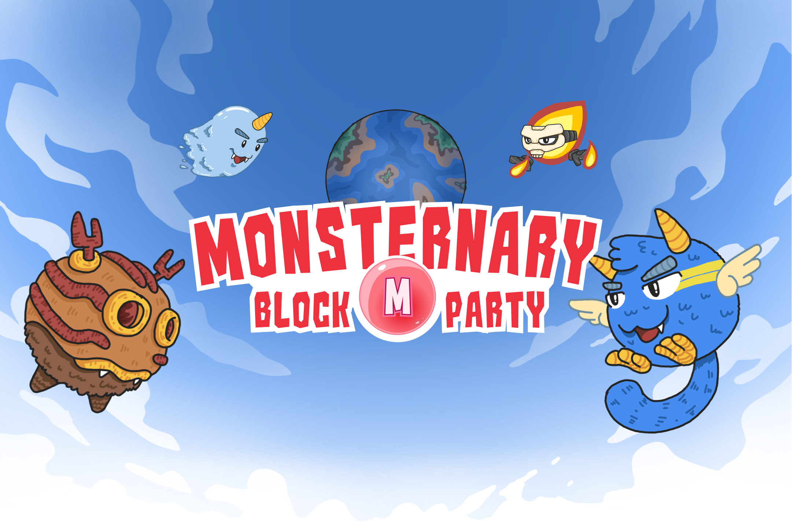

# What is Monsternary?

Monsternary is a play-to-earn and free-to-play game, every player who registers will get a pet monster, and can go on an adventure with the monster to gain experience and can increase the power of the monster.&#x20;

Monsternary is a Strategic, Metaverse, P2E an F2P game that has real player driven economy, wars and politics. The first Blockchain game to include Play to Journey mechanics - learn real world skills while playing. Unique NFT dynamics where your assets earn you lifetime passive income in $MONS.

There are two types of play in Monsternary:

*   Adventure

    Battle every monster in the wild, win and can caught them. You can sell them or make a team for the PvP battle. And can use monster in the wild to create unique equipment.
*   PvP Battle

    Become a legend through intense PvP arena battles. Every player can visit block arena to join a PvP arena battle, fight, win and get the rewards $MONS token.

### Disclaimer:&#x20;

The information provided in this litepaper is only for information purposes of the Monsternary game project. This should by no means be interpreted as a recommendation of investment in the game’s assets. Monsternary game asset prices are associated with risks that are above the control of the founding team such as market circumstances. Besides, the plan laid out in this document may be adjusted to adapt to future situations to achieve the best performance of the Monsternary platform.
